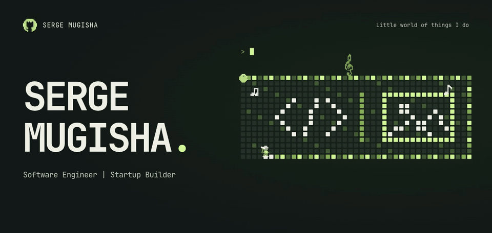
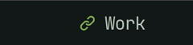
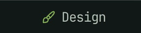
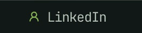
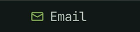

<picture>
  <source media="(prefers-reduced-motion: reduce) and (max-width: 600px)" srcset="assets/signal-mobile.png">
  <source media="(prefers-reduced-motion: reduce)" srcset="assets/signal.png">
  <source media="(max-width: 600px)" srcset="assets/signal-mobile.gif">
  
</picture><a href="https://sergemugisha.com/"><picture><source media="(max-width: 600px)" srcset="assets/signal-mobile-link-work.png"></picture></a><a href="https://www.behance.net/serge-mugisha"><picture><source media="(max-width: 600px)" srcset="assets/signal-mobile-link-design.png"></picture></a><a href="https://www.linkedin.com/in/serge-mugisha"><picture><source media="(max-width: 600px)" srcset="assets/signal-mobile-link-linkedin.png"></picture></a><a href="mailto:me@sergemugisha.com"><picture><source media="(max-width: 600px)" srcset="assets/signal-mobile-link-email.png"></picture></a>

